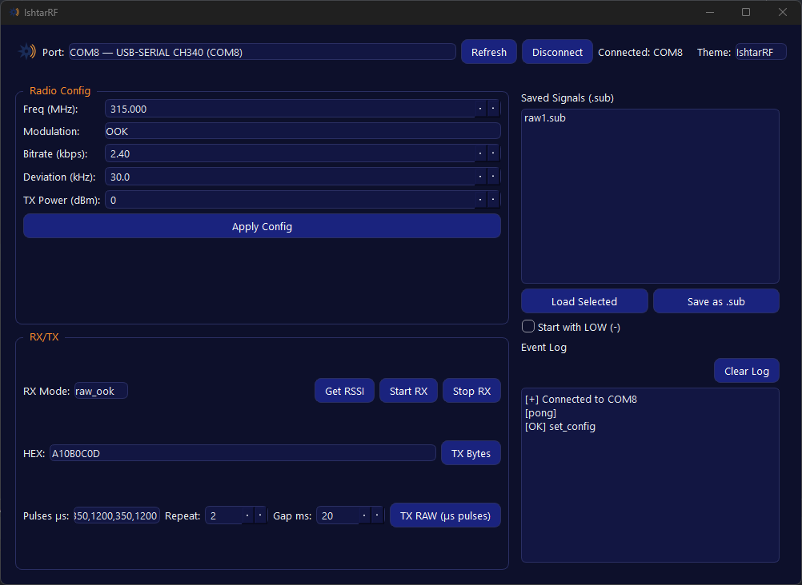

<p align="center">
  
</p>

# IshtarRF


**IshtarRF** is an open-source desktop tool to **receive, transmit, and save Sub-GHz signals** using **ESP32 + CC1101**.  
The app ships with a modern **PyQt6** UI and works with **`.sub`** (RAW) files compatible with Flipper/Bruce—load and replay raw pulse trains, or capture new ones and save them for later.

---

## Screenshots & Demo

- **Windows UI:**
  

- **Linux UI:**  
   _`images/Screenshot-ubuntu.png`_

- **Themes (Ishtar, Dark, Light):**  
    
    - `images/Screenshot-windows.png`
        
    - `images/Screenshot-dark.png`
        
    - `images/Screenshot-light.png`
        
---

## ⚠ Legal / RF Compliance

- You are responsible for complying with **local RF regulations** in your country/region.
    
- Use only **permitted frequencies, power levels, and protocols**.
        
---

## Features

- Modern **PyQt6** desktop app (Windows/Linux), **three themes**:
    
    - **IshtarRF**
        
    - **Dark**
        
    - **Light**
        
- **ESP32 + CC1101** firmware with a simple JSON serial protocol.
    
- **Capture RAW (OOK)** pulses and **save to `.sub`** (Flipper/Bruce-style RAW file).
    
- Load `.sub` files and **replay** them.
    
- Built-in **log** with one-click **Clear Log**.
    
- Minimal dependencies: **PyQt6**, **pyserial**.
    

---

## Requirements

- **Windows 10/11** or **Linux**
    
- **Python 3.11+** (Linux users can run the app directly; Windows users can use the packaged `.exe`)
    
- Hardware:
    
    - **ESP32 dev board**
        
    - **CC1101** (v1 or v2 — both work similarly; you won’t notice a difference)
        

---
## Quick Start (Desktop App using system Python)

> Requires Python 3.11+ installed system-wide.

### Windows (PowerShell)

```powershell
python -m pip install -r requirements.txt
python pc_app\app.py
```
# Linux
```bash
python3 -m pip install --user -r requirements.txt
python3 pc_app/app.py
```

> The app keeps `.sub` files in `pc_app/signals/` (created automatically).

---

## Download

**[Download latest release](https://github.com/CyberDuckyiq/IshtarRF/releases)**

---

## Firmware (ESP32 + CC1101)

### Arduino IDE

1. **Install ESP32 board support**  
    _Arduino IDE → Boards Manager → search “ESP32” → install “esp32” (by Espressif)._
    
2. **Install CC1101 library**  
    _Library Manager → search **ELECHOUSE_CC1101_SRC_DRV** → install._
    
3. **Wiring (SPI + GDOs)**  
    3.3V only — **do not use 5V** for CC1101.
    
    |Function|ESP32 Pin|CC1101 Pin|
    |---|--:|---|
    |SCK|**14**|SCK|
    |MISO|**12**|MISO (SO)|
    |MOSI|**13**|MOSI (SI)|
    |CS|**5**|CSN (CS)|
    |GDO0|**2**|GDO0|
    |GDO2|**4**|GDO2|
    |GND|**GND**|GND|
    |VCC|**3V3**|VCC (3.3V)|
        
4. **Open firmware sketch**  
    Open the firmware `.ino` in Arduino IDE, select the correct **Board** and **COM port**.
    
5. **Upload**  
    Click **Upload**. After flashing, open **Serial Monitor** (115200 baud) to confirm the device prints its JSON status messages.
    

> If the COM port is “busy” or “access denied”, ensure no other program (e.g., another serial terminal) is holding the port, then unplug/replug the board.

---

## Using `.sub` Files

- The app reads/writes **RAW `.sub`** files compatible with Flipper/Bruce style.
    
- Files are stored in **`pc_app/signals/`**.
    
- Export format (example):
    
    ```
    Filetype: IshtarRF SubGhz RAW File
    Version: 1
    Frequency: 433920000
    Preset: FuriHalSubGhzPresetOok270Async
    Protocol: RAW
    RAW_Data: 350 -1200 350 -1200  ...
    ```

---

## Build a Windows `.exe`

If you want a standalone Windows app:

> Run from the `pc_app/` folder.

```powershell
pip install pyinstaller; pyinstaller .\app.py --noconsole --onefile --name IshtarRF --icon .\IshtarRF-logo.ico --add-data "IshtarRF-logo.ico;." --add-data "IshtarRF-logo.png;." --exclude-module matplotlib --clean --noconfirm
```
    
- The app will create `signals/` next to itself on first run.
    


---

## Linux

Use the Python quick-start above.  
_`images/Screenshot-ubuntu.png`._

---

## Hardware 

- Required hardware: **ESP32 dev board** + **CC1101** (v1 or v2).
    
---

## Troubleshooting

- **Access denied / port busy** → Close other serial apps (Arduino Serial Monitor, etc.) before starting IshtarRF.
    
- **No captured pulses** → Ensure RX mode is **raw_ook**, correct frequency (e.g., 433.92 MHz), and your remote is within range.
    
---
## License

[](LICENSE)

Copyright (c) 2025 Cyber Ducky.

This project (desktop app and ESP32 firmware) is licensed under the **GNU Affero General Public License v3.0 (AGPL-3.0-only)**.  
See the full text in [`LICENSE`](LICENSE).
